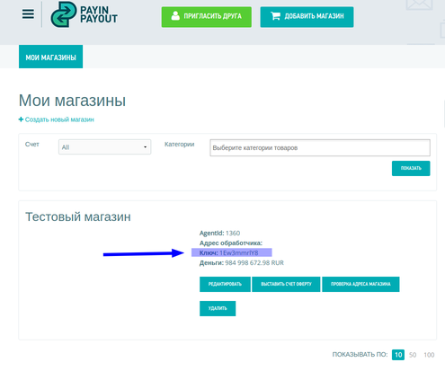

#### Добавление выбора метода оплаты на страницу

Для того чтобы отправить пользователя непосредственно на форму оплаты необходимо зарегистрировать платёж
как указано здесь: [форма регистрации платежа](README.md/#Форма-регистрации-платежа)

В случае успеха браузер пользователя получает [заголовок Location](https://ru.wikipedia.org/wiki/HTTP_location)
вследствии чего перенаправляется далее на форму оплаты платежа где пользователем и совершается оплата.

После оплаты система payin-payout отправляет запрос чтобы уведомить магазин.

##### Пошаговые действия

1) Регистрируетесь в системе payin-payout и создаёте в личном кабинете магазин.

2) Решаете с менеджментом все возникающие вопросы.

3) Получаете ключ API для работы

4) Далее необходимо реализовать на вашем сайте формирование массива данных которые нужно передать по API
для регистрации платежа. Эти данные описаны здесь: [форма регистрации платежа](README.md/#Форма-регистрации-платежа)

5) Нужно добавить на сайт форму или ссылки, либо яваскрипт, что угодно что позволяет отправить GET или POST запрос с
требуемыми параметрами на адрес https://lk.payin-payout.net/api/shop .

6) После реализации этой части пользователь может с вашего сайта перенаправляться на платёжную форму и совершать оплату.

7) Реализовать приём запроса от системы payin-payout который уведомляет о результате попытки оплаты.
Детальнее это описано здесь: [Проверка информации о платеже](README.md/#Проверка-информации-о-платеже)
Когда будет получено уведомление о успешной оплате можно обрабатывать логику выдачи/отправки товара и т.п.