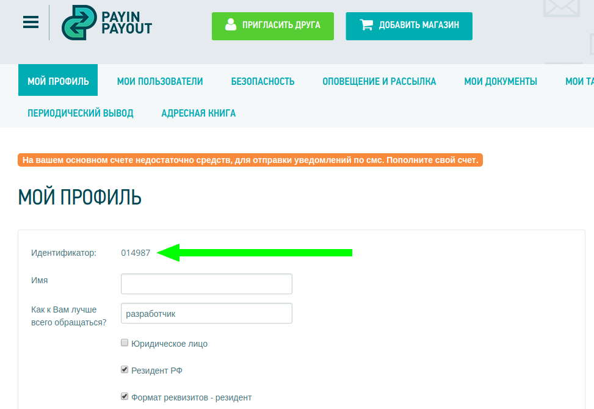
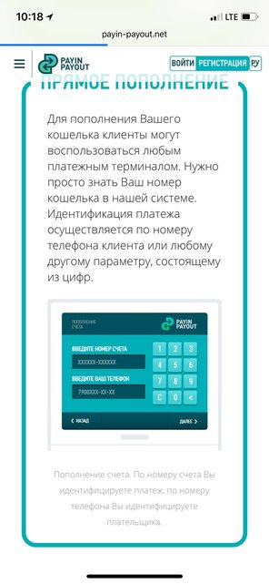
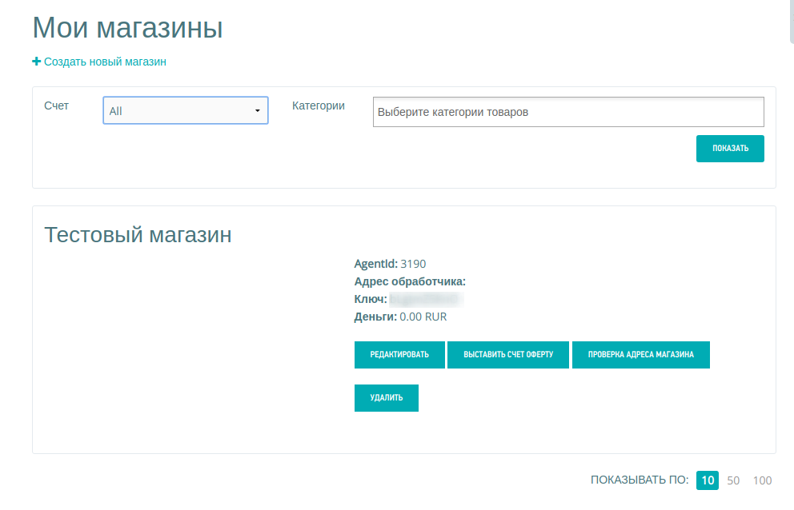

# Терминальные зачисления без предварительного создания счёта

В личном кабинете в информации о профиле можно найти идентификатор пользователя

#### Личный кабинет

Этот параметр должен участвовать в формировании номера счёта который будет оплачиваться плательщиком.

Второй параметр может быть произвольным, тогда идентифицировать плательщика можно по номеру телефона
который присутствует в форме пополнения на терминале.

#### Пример формы пополнения

Например, в случае идентификации пользователя по номеру счёта, плательщику присваивается идентификатор 333444,
а у профиля партнёра в системе payin-payout идентификатор 014987 (его можно увидеть в [информации о своём профиле](#Личный-кабинет)).

Пользователь направляется к терминалу, указывает в форме свой номер телефона и номер счёта 014987-333444 и
совершает оплату.

После того как оплата завершается успехом,на адрес указанный в настройках магазина приходит callback с POST запросом
в котором присутствуют следующие параметры:

| Параметр      | Значение              | Описание  |
| ------------- |:---------------------:| ---------:|
| orderId       | null                  | В этом поле продавец задает уникальный номер заказа (счета) в соответствии со своей системой учета и передаёт при создании платежа по API. В текущем кейсе отсутствует |
| agentId       | 3190                  | Идентификатор агента (сайта) продавца, на который покупатель должен совершить платеж ([пример можно увидеть ниже](#Информация-о-магазине-пользователя)). |
| paymentId     | 64411122223333        | Идентификатор платежа |
| amount        | 10.00                 | Сумма платежа |
| currency      | RUR                   | Валюта платежа |
| phone         | +79231112233          | Номер телефона указанный плательщиком |
| preference    | 2                     | Идентификатор способа оплаты, который будет выбран при оплате за товар. см. Приложение №1. Если в системе не задан, то вернет значение 0 |
| paymentStatus | 1                     | Идентификатор статуса платежа, может иметь следующие значения :   1 — Прошел успешно   2 — Фатальная ошибка, платеж не  прошел   3 — Платеж был частично оплачен   |
| paymentDate   | 07:01:34 24.10.2017   | Дата и время реального прохождения платежа в системе Payin-payout |
| goods         | 343456                | Описание предоставляемой услуги или товара |
| agentName     | null                  | Название агента, понятное плательщику, например брэнд или товарный знак под которым работает агент |
| course        | 1.00000000            | Обменный курс |
| course_account| 1.00000000            | Отношение входящей валюты к валюте счета |
| inputId       | null                  | Повторяет номер заказа |
| outputId      | 014987-333444         | Номер счёта состоящие из идентификатора учётной записи и присвоенного плательщику идентификатора |
| userName      |                       | Имя (и фамилия) покупателя. Будет показано в счете в качестве покупателя. |
| sign          | 34g03gj4390gj598gj    | Пдпись |

#### Пример информации о магазине

#### Обработка callback-а

После поступления callback-а уведомляющего о успешной оплате необходимо использовать поле outputId
для поиска учётной записи плательщика.

Альтернативно можно использовать номер телефона указанный пользователем для идентификации плательщика.